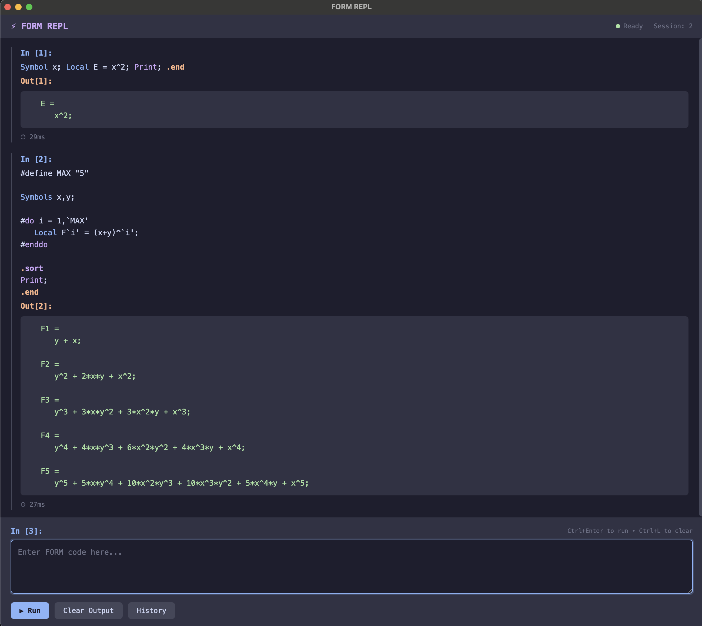

# FORM REPL v0.2.0

一个为 FORM 计算机代数系统提供的交互式 REPL（读取-求值-输出循环），具有**语法高亮**和**类 IPython 用户体验**。



## v0.2.0 新功能

### ✨ 语法高亮
为 FORM 代码提供实时语法高亮：
- **关键词**: `id`, `repeat`, `if`, `else`, `while` 等
- **声明语句**: `Symbol`, `Local`, `CFunction`, `Index` 等
- **内置函数**: `abs`, `sin`, `cos`, `gcd` 等
- **注释**: 以 `*` 开头的行
- **数字、运算符、字符串**

### 🐍 类 IPython 用户体验
- **编号提示符**: `In [1]:`, `Out[1]:`
- **魔术命令**: `%history`, `%time`, `%who`, `%reset`
- **持久化历史记录**: 跨会话保存
- **输出跟踪**: 访问之前的输出结果

### 🎨 多种主题
8 种内置主题：
- `default`, `solarized-dark`, `monokai`, `dracula`
- `nord`, `gruvbox`, `one-dark`, `none`（纯文本）

### ⚙️ 配置文件
创建 `~/.form_replrc` 自定义默认设置。

---

## 安装

### 前置条件
- Rust 1.70+
- PATH 中包含 FORM 可执行文件或设置 `FORM_PATH`

### 编译构建
```sh
cargo build --release
```

二进制文件位置：`target/release/form-repl`

---

## 快速开始

```sh
# 基本用法
./form-repl

# 启用语法高亮（推荐）
./form-repl -H

# 使用指定主题
./form-repl -t dracula

# 查看所有选项
./form-repl --help
```

---

## 命令行选项

```
form-repl [OPTIONS]

选项：
  -h, --help          显示帮助信息
  -V, --version       显示版本号
  -H, --highlight     启用语法高亮
  -t, --theme NAME    设置颜色主题
  -v, --verbose       启用调试输出
  --list-themes       列出可用主题
  --sample-config     打印示例配置文件
```

**注意**: `-h` 用于显示帮助（标准约定）。高亮功能请使用 `-H`。

---

## 用户界面

### IPython 风格提示符

```
FORM REPL v0.2.0 — 输入 %help 获取帮助，.quit 退出

────────────────────────────────────────────────────────────
In [1]: Symbol x,y;
   ...: Local E = (x+y)^2;
   ...: Print;
   ...: .end

Out[1]:    E =
              x^2 + 2*x*y + y^2;

────────────────────────────────────────────────────────────
In [2]:
```

### 语法高亮示例

使用 `--highlight` 或 `-H` 后：
- `Symbol` 显示为蓝色（声明语句）
- `Local` 显示为蓝色（声明语句）
- `x`, `y`, `E` 显示为标识符
- `Print` 显示为洋红色（关键词）
- 数字如 `2` 显示为紫色
- `.end` 显示为橙色（预处理器指令）

---

## REPL 命令

所有命令以 `.` 开头，且必须在第一行：

| 命令 | 描述 |
|------|------|
| `.help` | 显示帮助信息 |
| `.quit`, `.exit`, `.q` | 退出 REPL |
| `.clear` | 清除当前输入缓冲区 |

---

## 魔术命令

所有魔术命令以 `%` 开头：

| 命令 | 描述 |
|------|------|
| `%help`, `%?` | 显示帮助 |
| `%quit`, `%exit`, `%q` | 退出 |
| `%history [N]` | 显示最近 N 条历史记录（默认 10） |
| `%time` | 切换计时显示 |
| `%who` | 列出已声明的符号 |
| `%reset` | 清除会话状态 |
| `%recall [N]` | 回忆第 N 个会话的输入 |
| `%last`, `%_` | 显示最后输出 |
| `%theme` | 列出可用主题 |
| `%info` | 显示会话信息 |
| `%lsmagic` | 列出所有魔术命令 |

### 使用示例

```
In [1]: %history 5
```
显示最近 5 条历史记录，包含输入和输出。

```
In [2]: %time
Timing display: ON
```
切换每次执行后的计时信息显示。

```
In [3]: %who
Declared symbols: E, x, y
```
列出当前会话中声明的所有符号。

---

## 配置文件

创建 `~/.form_replrc`：

```toml
[settings]
highlight = true
theme = "dracula"
show_timing = false
verbose = false
auto_end = true

[history]
file = "~/.form_repl_history"
max_entries = 1000
save_on_exit = true
```

生成示例配置：
```sh
./form-repl --sample-config > ~/.form_replrc
```

---

## 主题

| 主题 | 风格 |
|------|------|
| `default` | 柔和、平衡的颜色 |
| `none` | 无颜色（纯文本） |
| `solarized-dark` | Ethan Schoonover 的 Solarized 主题 |
| `monokai` | 仿 Sublime Text |
| `dracula` | 深紫色主题 |
| `nord` | 北极，蓝色调 |
| `gruvbox` | 复古风格 |
| `one-dark` | 仿 Atom 编辑器 |

---

## 示例

### 基本表达式

```
In [1]: Symbol x;
   ...: Local E = x^2 + 2*x + 1;
   ...: Print;
   ...: .end

Out[1]:    E =
              x^2 + 2*x + 1;
```

### 模式匹配

```
In [2]: CFunction f;
   ...: Symbol x;
   ...: Local E = f(1,2,x,3,4);
   ...: id f(?a,x,?b) = f(?b,?a);
   ...: Print;
   ...: .end

Out[2]:    E =
              f(3,4,1,2);
```

### 使用历史记录

```
In [3]: %history 2
In [1]: Symbol x;
        Local E = x^2 + 2*x + 1;
        Print;
Out[1]:    E = ...

In [2]: CFunction f;
        ...
```

---

## 快捷键

| 按键 | 功能 |
|------|------|
| Enter | 继续输入下一行 / 空行时提交 |
| Ctrl+C | 取消当前输入 |
| Ctrl+D | 提交或退出 |
| 上/下方向键 | 浏览历史记录 |
| Ctrl+A | 移动到行首 |
| Ctrl+E | 移动到行尾 |
| Ctrl+L | 清屏 |

---

## 环境变量

| 变量 | 描述 |
|------|------|
| `FORM_PATH` | FORM 可执行文件路径 |

---

## 常见问题

### "找不到 FORM 可执行文件"
设置 FORM_PATH 环境变量：
```sh
export FORM_PATH=/path/to/form
```

### 颜色不显示
确保终端支持 256 色，并使用 `-H` 参数。

### 历史记录未保存
检查 `~/.form_repl_history` 文件的权限。

---

## v0.1 以来的变更

1. **修复**: `-h` 现在显示帮助（之前是高亮）
2. **新增**: FORM 语法的实时语法高亮
3. **新增**: 类 IPython 的 `In [N]:`/`Out[N]:` 提示符
4. **新增**: 魔术命令（`%history`, `%time` 等）
5. **新增**: 跨会话持久化历史记录
6. **新增**: 配置文件支持
7. **新增**: `FORM_PATH` 环境变量支持
8. **新增**: 8 种颜色主题
9. **新增**: 输入验证（括号匹配）
10. **改进**: 带上下文的错误提示

---

## 许可证

Apache-2.0 许可证

## 相关链接

- [FORM 官方网站](http://www.nikhef.nl/~form)
- [FORM GitHub 仓库](https://github.com/vermaseren/form)
